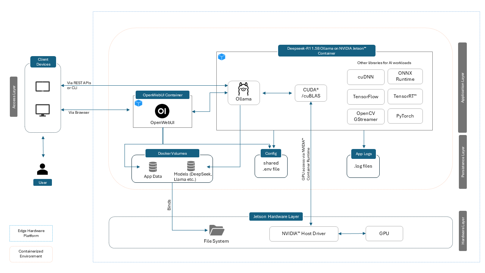
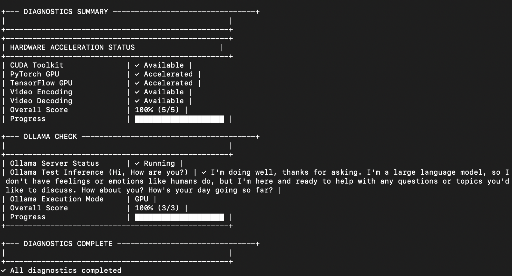
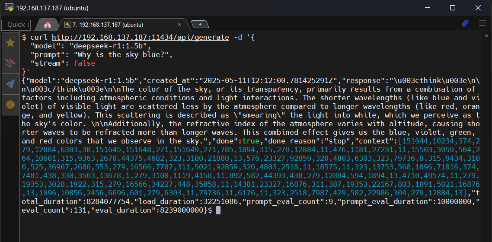

# Deepseek-R1 1.5B Ollama on NVIDIA Jetson™

**Version:** 1.0
**Release Date:** May 2025
**Copyright:** © 2025 Advantech Corporation. All rights reserved.

## Overview
DeepSeek-R1 1.5B Ollama on NVIDIA Jetson™ provides Ollama & DeepSeek R1 1.5B Model for a streamlined, hardware-accelerated environment for developing and deploying conversational AI applications on NVIDIA Jetson™ devices. This container integrates OpenWebUI for a user-friendly chat interface and leverages the DeepSeek language model for efficient on-device inference. It includes hardware-accelerated AI software components, delivering a complete development environment. Optimized for edge deployments, it ensures high performance, low latency, and reliable real-time AI interaction.

## Key Features

| Feature | Description |
|--------|-------------|
| Ollama Backend | Run large language models (LLMs) locally with simple setup and management |
| Integrated OpenWebUI | Clean, user-friendly frontend for LLM chat interface |
| DeepSeek R1 1.5B Inference | Efficient on-device LLM via Ollama; minimal memory, high performance |
| Model Customization | Create or fine-tune models using `ollama create` |
| REST API Access | Simple local HTTP API for model interaction |
| Flexible Parameters | Adjust inference with `temperature`, `top_k`, `repeat_penalty`, etc. |
| Modelfile Customization | Configure model behavior with Docker-like `Modelfile` syntax |
| Prompt Templates | Supports formats like `chatml`, `llama`, and more |
| Offline Capability | Fully offline after container image setup; no internet required |


## Architecture


## Repository Structure
```
Deepseek-R1-1.5B-Ollama-on-NVIDIA-Jetson/
├── .env                                      # Environment configuration
├── build.sh                                  # Build script
├── wise-bench.sh                             # Wise Bench script
├── docker-compose.yml                        # Docker Compose setup
├── start_services.sh                         # Starts ollama and pulls DeepSeek R1 1.5B model and runs it within container
├── README.md                                 # Overview & quick start steps
├── quantization-readme.md                    # Model quantization steps
├── other-AI-capabilities-readme.md           # Other AI capabilities supported by container image
├── efficient-prompting-for-compact-models.md # Craft better prompts for small and quantized language models
├── llm-models-performance-notes-readme.md    # Performance notes of LLM Models
├── .gitignore                                # Git ignore specific files
└── customization-readme.md                   # Customization, optimization & configuration guide
```
## Container Description

### Quick Information

`build.sh` will start following two containers:

| Container Name | Description |
|-----------|---------|
| Deepseek-R1-1.5B-Ollama-on-NVIDIA-Jetson | Provides a hardware-accelerated development environment using various AI software components along with Deepseek R1 1.5B & Ollama   |
| openweb-ui-service | Optional, provides UI which is accessible via browser for inferencing |

### Deepseek-R1 1.5B Ollama on NVIDIA Jetson Container Highlights

This container leverages [**Ollama**](https://ollama.com/) as the local inference engine to serve LLMs efficiently on NVIDIA Jetson™ devices. Ollama provides a lightweight and container-friendly API layer for running language models without requiring cloud-based services.

| Feature                        | Description |
|-------------------------------|-------------|
| Local Inference Engine    | On-device model (Deepseek R1 1.5B) inference via Ollama’s REST API. |
| OpenAI API Compatibility | Supports OpenAI Chat Completions API; works with LangChain and OpenWebUI. |
| Streaming Output Support | Real-time token streaming for chat UIs. |
| Edge Optimized            | Works with quantized `.gguf` models |
| Model Management          | Pull from Ollama library or convert Hugging Face models |
| Customizable Behavior | Tune params (e.g., `temperature`, `top_k`) via `Modelfile`. |
| Prompt Engineering | Supports system/user prompt separation and composition. |
| Offline-First             | No internet needed after model download; ensures privacy. |
| Developer Friendly        | Simple CLI and Docker support for local deployment. |
| Easy Integration          | Backend-ready for LangChain, FastAPI, RAG, UIs, etc. |
| AI Dev Environment        | Full HW-accelerated container for AI development. |


### OpenWebUI Container Highlights

OpenWebUI serves as a clean and responsive frontend interface for interacting with LLMs via APIs like Ollama or OpenAI-compatible endpoints. When containerized, it provides a modular, portable, and easily deployable chat interface suitable for local or edge deployments.

| Feature                         | Description                                                     |
|---------------------------------|-----------------------------------------------------------------|
| User-Friendly Interface         | Sleek, chat-style UI for real-time interaction.                 |
| OpenAI-Compatible Backend       | Works with Ollama, OpenAI, and similar APIs with minimal setup. |
| Container-Ready Design          | Lightweight and optimized for edge or cloud deployments.        |
| Streaming Support               | Enables real-time response streaming for interactive UX.        |
| Authentication & Access Control | Basic user management for secure access.                        |
| Offline Operation               | Runs fully offline with local backends like Ollama.             |


## List of READMEs

| Module                       | Link                                                  | Description                                                                |
|------------------------------|-------------------------------------------------------|----------------------------------------------------------------------------|
| Quick Start                  | [README](./README.md)                                 | Overview of the container image                                            |
| Customization & optimization | [README](./customization-readme.md)                   | Steps to customize a model, configure environment, and optimize            |
| Model Performances           | [README](./llm-models-performance-notes-readme.md)    | Performance stats of various LLM Models                                    |
| Other AI Capabilities        | [README](./other-AI-capabilities-readme.md)           | Other AI capabilities supported by the container                           |
| Quantization                 | [README](./quantization-readme.md)                    | Steps to quantize a model                                                  |
| Prompt Guidelines            | [README](./efficient-prompting-for-compact-models.md) | Guidelines to craft better prompts for small and quantized language models |

## Model Information  

This image uses DeepSeek R1-1.5B for inferencing; here are the details about the model used:

| Item                                                   | Description                     |
|--------------------------------------------------------|---------------------------------|
| Model source                                           | Ollama Model (deepseek-r1:1.5b) |
| Model architecture                                     | Qwen2                           |
| Model quantization                                     | Q4_K_M                          |
| Ollama command                                         | ollama pull deepseek-r1:1.5b    |
| Number of Parameters                                   | ~1.78 B                         |
| Model size                                             | ~1.1 GB                         |
| Default context size (unless changed using parameters) | 2048                            |

## Hardware Specifications

| Component       | Specification                                     |
|-----------------|---------------------------------------------------|
| Target Hardware | NVIDIA Jetson™                                    |
| GPU             | NVIDIA® Ampere architecture with 1024 CUDA® cores |
| DLA Cores       | 1 (Deep Learning Accelerator)                     |
| Memory          | 4/8/16 GB shared GPU/CPU memory                   |
| JetPack Version | 5.x                                               |

## Software Components

The following software components are available in the base image:

| Component    | Version        | Description                        |
|--------------|----------------|------------------------------------|
| CUDA®        | 11.4.315       | GPU computing platform             |
| cuDNN        | 8.6.0          | Deep Neural Network library        |
| TensorRT™    | 8.5.2.2        | Inference optimizer and runtime    |
| PyTorch      | 2.0.0+nv23.02  | Deep learning framework            |
| TensorFlow   | 2.12.0 | Machine learning framework         |
| ONNX Runtime | 1.16.3         | Cross-platform inference engine    |
| OpenCV       | 4.5.0          | Computer vision library with CUDA® |
| GStreamer    | 1.16.2         | Multimedia framework               |


The following software components/packages are provided further as a part of this image:

| Component | Version | Description |
|-----------|---------|-------------|
| Ollama | 0.5.7 | LLM inference engine |
| OpenWebUI | 0.6.5 | Provided via separate OpenWebUI container for UI  |
| DeepSeek R1 1.5B | N/A | Pulled inside Ollama container and persisted via docker volume  |

## Quick Start

### Installation

```
# Clone the repository
git clone https://github.com/Advantech-EdgeSync-Containers/Nagarro-Container-Project.git
cd Deepseek-R1-1.5B-Ollama-on-NVIDIA-Jetson

# Make the build script executable
chmod +x build.sh

# Launch the container
sudo ./build.sh
```

### Run Services

After installation succeeds, by default control lands inside the container. Run the following command to start services within the container.

```
# Under /workspace, run this command
# Provide executable rights
chmod +x start_services.sh

# Start services
./start_services.sh
```
Allow some time for the OpenWebUI and Jetson™ DeepSeek Ollama container to settle and become healthy.

### AI Accelerator and Software Stack Verification (Optional)
```
# Verify AI Accelerator and Software Stack Inside Docker Container
/workspace/wise-bench.sh
```



Wise-bench logs are saved in `wise-bench.log` file under `/workspace`

### Check Installation Status
Exit from the container and run the following command to check the status of the containers:
```
sudo docker ps
```
Allow some time for containers to become healthy.

### UI Access
Access OpenWebUI via any browser using the URL given below. Create an account and perform a login:
```
http://localhost_or_Jetson_IP:3000
```
### Select Model
In case Ollama has multiple models available, choose from the list of models on the top-left of OpenWebUI after signing up/logging in successfully. As shown below. Select DeepSeek R1 1.5B:


### Quick Demonstration:


## Prompt Guidelines

This [README](./efficient-prompting-for-compact-models.md) provides essential prompt guidelines to help you get accurate and reliable outputs from small and quantized language models.

## Ollama Logs and Troubleshooting

### Log Files

Once services have been started inside the container, the following log files are generated:

| Log File | Description |
|-----------|---------|
| ollama.pid | Provides process-id for the currently running Ollama service   |
| ollama.log | Provides Ollama service logs |

### Troubleshoot

Here are quick commands/instructions to troubleshoot issues with the Jetson™ Deepseek Ollama Container:

- View Ollama service logs within the Ollama container
  ```
  tail -f ollama.log
  ```

- Check if the model is loaded using CPU or GPU or partially both (ideally, it should be 100% GPU loaded).
  ```
  ollama ps
  ```

- Kill & restart services within the container (check pid manually via `ps -eaf` or use pid stored in `ollama.pid`)
  ```
  kill $(cat ollama.pid)
  ./start_services.sh
  ```

  Confirm there is no Ollama service running using:
  ```
  ps -eaf
  ```

- Enable debug mode for the Ollama service (kill the existing Ollama service first).
  ```
  export OLLAMA_DEBUG=true
  ./start_services.sh
  ```
- In some cases, it has been found that if Ollama is also present at the host, it may give permission issues during pulling models within the container. Uninstalling host Ollama may solve the issue quickly. Follow this link for uninstallation steps - [Uninstall Ollama.](https://github.com/ollama/ollama/blob/main/docs/linux.md#uninstall)

## Ollama Python Inference Sample
Here's a Python example to draw inference using the Ollama API. This script sends a prompt to an Ollama model (e.g., Meta Llama3.2 1B, DeepSeek R1 1.5B, etc.) and retrieves the response.

### Prerequisites
Please ensure the following prerequisites:

- Ollama is accessible within the container (refer to the Ollama external access section in the Customization README).
- An Ollama model is already pulled.
 Ensure the Python requests package is already installed or install it using the below command:
  ```
  pip install requests
  ```

### Run script
Run the following script inside the container using Python.

```
import requests
import json

def generate_with_ollama_stream(prompt, model='deepseek-r1:1.5b'):
    url = "http://localhost:11434/api/generate"
    headers = {"Content-Type": "application/json"}
    payload = {
        "model": model,
        "prompt": prompt,
        "stream": True
    }

    with requests.post(url, json=payload, headers=headers, stream=True) as response:
        if response.status_code != 200:
            raise Exception(f"Error: {response.status_code} - {response.text}")

        print("Generated Response:\n")
        for line in response.iter_lines():
            if line:
                try:
                    data = json.loads(line)
                    token = data.get("response", "")
                    print(token, end="", flush=True)
                except json.JSONDecodeError as e:
                    print(f"[Error decoding JSON chunk]: {e}")

# Example usage
if name == "__main__":
    prompt = "Explain quantum computing in simple terms."
    generate_with_ollama_stream(prompt, model="deepseek-r1:1.5b")

```
Save it as script.py and run it using the following command:
```
python3 script.py
```
The inference stream should get started after running this.

## Best Practices and Recommendations

### Memory Management & Speed
- Ensure models are fully loaded into GPU memory for best results.
- Batch inference for better throughput
- Use stream processing for continuous data
- Offload unwanted models from GPU (use the Keep-Alive parameter for customizing this behavior; the default is 5 minutes).
- Enable Jetson™ Clocks for better inference speed
- Used quantized models to balance speed and accuracy
- Increase swap size if models loaded are large
- Use lesser context & batch size to avoid high memory utilization
- Set max-tokens in API payloads to avoid unnecessarily long response generations, which may affect memory utilization.
- It is recommended to use models with parameters <=3B and Q4/Q8 quantization.

### Ollama Model Behavior Corrections 
- Restart Ollama services
- Remove the model once and pull it again
- Check if the model is correctly loaded into the GPU or not; it should show loaded as 100% GPU. 
- Create a new Modelfile and set parameters like temperature, repeat penalty, system, etc., as needed to get expected results.


## REST API Access

[**Official Documentation**](https://github.com/ollama/ollama/blob/main/docs/api.md)

### Ollama APIs
Ollama APIs are accessible on the default endpoint (unless modified). If needed, APIs could be called using code or curl as below:

Inference Request:
```
curl http://localhost_or_Jetson_IP:11434/api/generate -d '{
  "model": "deepseek-r1:1.5b",
  "prompt": "Why is the sky blue?",
  "stream": false
}'
```
Here stream mode could be changed to true/false as per the needs.

Response:
```
{
  "model": "deepseek-r1:1.5b",
  "created_at": "2023-08-04T08:52:19.385406455-07:00",
  "response": "<HERE_WILL_THE_RESPONSE>",
  "done": false
}
```
Sample Screenshot:



For further API details, please refer to the official documentation of Ollama as mentioned on top.


## Known Limitations

1. Execution Time: The model, when inferred for the first time via OpenWebUI, takes longer time (within 10 seconds) as the model gets loaded into the GPU. 
2. RAM Utilization: RAM utilization for running this container image occupies approximately <=5 GB RAM when running on NVIDIA® Orin™ NX – 8 GB. Running this image on Jetson™ Nano may require some additional steps, like increasing swap size or using lower quantization as suited. 
3. OpenWebUI Dependencies: When OpenWebUI is started for the first time, it installs a few dependencies that are then persisted in the associated Docker volume. Allow it some time to set up these dependencies. This is a one-time activity. 


## Possible Use Cases

Leverage the container image to build interesting use cases like:

- Private LLM Inference on Local Devices: Run large language models locally with no internet requirement—ideal for privacy-critical environments

- Lightweight Backend for LLM APIs: Use Ollama to expose models via its local API for fast integration with tools like LangChain, FastAPI, or custom UIs.

- Document-Based Q&A Systems: Combine Ollama with a vector database to create offline RAG (Retrieval-Augmented Generation) systems for querying internal documents or manuals.

- Rapid Prototyping for Prompt Engineering: Use the Modelfile to fine-tune system prompts, default instructions, and model parameters—great for experimenting with prompt structures or multi-turn workflows.

- Multilingual Assistants: Deploy multilingual chatbots using local models that can translate, summarize, or interact in different languages without depending on cloud services.

- LLM Evaluation and Benchmarking Easily swap and test different quantized models (e.g., Mistral, LLaMA, DeepSeek) to compare performance, output quality, and memory usage across devices.

- Custom Offline Agents: Use Ollama as the reasoning core of intelligent agents that interact with other local tools (e.g., databases, APIs, sensors)—especially powerful when paired with LangChain

- Edge AI for Industrial Use: Deploy Ollama on Edge to enable intelligent interfaces, command parsing, or decision-support tools at the edge.


Copyright © 2025 Advantech Corporation. All rights reserved.