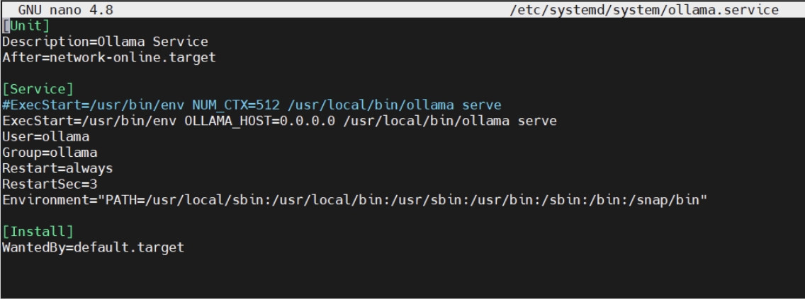

# Model Customization & Environment Configuration

## Model Customization 
If needed, the Ollama model can be customized as per the requirements. Follow this for customizing the model to achieve expected inference results by tweaking the following parameters using Modelfile: 

| Parameter                                               | Description                |
|---------------------------------------------------------|----------------------------|
| SYSTEM                                                  | Defines the default behavior or personality of the model. Acts like a system prompt for alignment (e.g., "You are a coding assistant.").  |
| TEMPLATE                                                | Defines the prompt structure used (e.g., chatml, llama, alpaca, etc.) to format user/assistant messages.   |
| TEMPERATURE                                             | Controls randomness. Lower = more deterministic; higher = more creative/unpredictable. Range: 0.0 – 2.0  |
| REPEAT_PENALTY                                          | Penalizes repetition in output. Values greater than 1.0 reduce repeated phrases. Default is around 1.1  |
| TOP_P                                                   | Enables nucleus sampling—limits token selection to a cumulative probability (e.g., 0.95). Helps control diversity  |
| TOP_K                                                   | Limits sampling to the top K most probable next tokens (e.g., 50). Lower values = more focused output  |

For other parameters refer to this official documentation from [**Ollama**](https://github.com/ollama/ollama/blob/main/docs/modelfile.md). These are the steps to create a model using Modelfile. The above parameters can be customized by either using Modelfile as below ```.env``` or by using the Modelfile. In case of customization done by Modelfile, do replace the MODEL_NAME in ```.env``` the file with the new model name.

- Create a Modelfile

    ```
    touch Modelfile
    ```

- Example Modelfile
  For details about these parameters, take a look at the ```.env``` file or Ollama documentation as mentioned above.
  ```
  # Mention the model to be used, it could be any Ollama model 
  # or local .gguf model (placed at same path as Modelfile)
  FROM deepseek-r1:1.5b 

  # System prompt to guide model behavior 

  SYSTEM "You are a helpful assistant. Answer concisely and accurately." 

  # Use a predefined prompt formatting template 

  TEMPLATE "chatml" 

  # Adjust model inference parameters 

  PARAMETER temperature 0.7 

  PARAMETER repeat_penalty 1.1 

  PARAMETER top_p 0.95 

  PARAMETER top_k 50 
  ```

- Build the model using Ollama. 
  ```
  ollama create deepseek-r1-1.5b-custom -f Modelfile 
  ```

- Run the model directly using the following command: 
  ```
  ollama run deepseek-r1-1.5b-custom --verbose
  ```  

The custom model can also be accessed directly from OpenWebUI; on the top left, go to the Select Model dropdown, select the custom model, and start using it. 


## Environment Configuration

The `.env` file allows you to customize the runtime behavior of the container using environment variables.

### Key Environment Variables
``` bash
# --- Model Settings ---
# Model will be pulled from Ollama models repository
# Any other ollama or custom built model can be used here if needed
MODEL_NAME=deepseek-r1:1.5b

# --- Docker Compose File Settings---
COMPOSE_FILE_PATH=./docker-compose.yml

# --- Open Web UI Settings ---
OPENWEBUI_PORT=3000
OPENAI_API_OLLAMA_BASE=http://localhost:11434/v1

 
```

## Ollama External Access
- Edit the Ollama service by accessing its service file on the device.
  ```
    sudo nano /etc/systemd/system/ollama.service
  ```


- Replace the Ollama Serve command with
  ```
    ExecStart=/usr/bin/env OLLAMA_HOST=0.0.0.0 /usr/local/bin/ollama serve
  ```
- Reload daemon and restart Ollama service
  ```
    sudo systemctl daemon-reload
    sudo systemctl restart ollama
  ```
- Now verify that Ollama should be accessible on the following address in a browser externally
  ```
    http://<device_ip>:11434
  ```
  It should display ‘Ollama is running.’ 

 

## Ollama Model Memory Usage Optimization

### Enabling Flash Attention & KV Cache Quantization

Combining KV Cache Quantization and Flash Attention often results in better memory efficiency and performance. Different models behave differently for these settings; it is advised to test the accuracy after setting these for running intended models.


- Stop the existing Ollama service. 
- Export the following environment variables:
  ```
  export OLLAMA_FLASH_ATTENTION=1 # this enables flash attention
  export OLLAMA_KV_CACHE_TYPE=q4_0 # f16 is by default, q8_0 reduces cache usage to half of f16, and q4_0 to 1/4th of usage in f16
  ```
- Start the Ollama service. 
- Check memory utilization by ollama logs; kv-cache size would be reduced. 
- Before Optimization


- After Optimization
